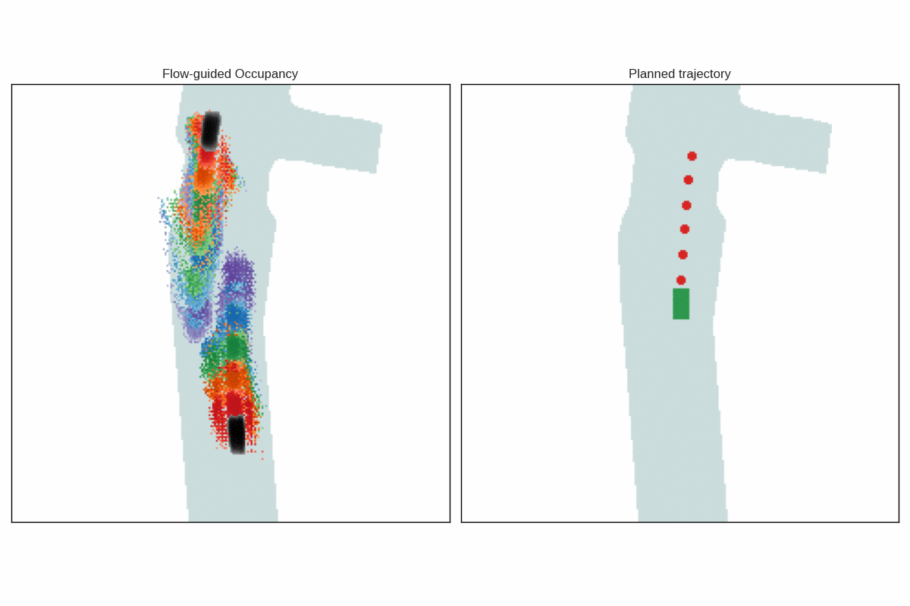
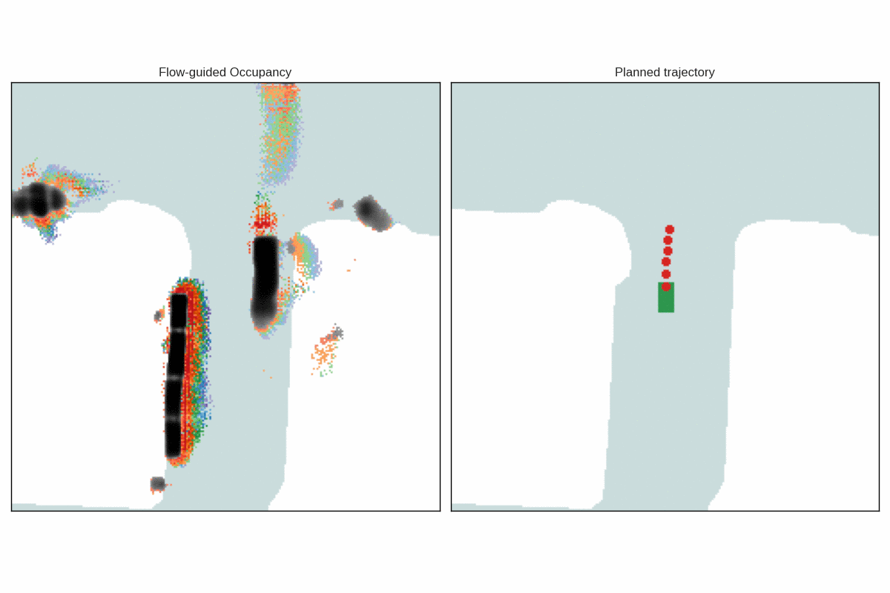
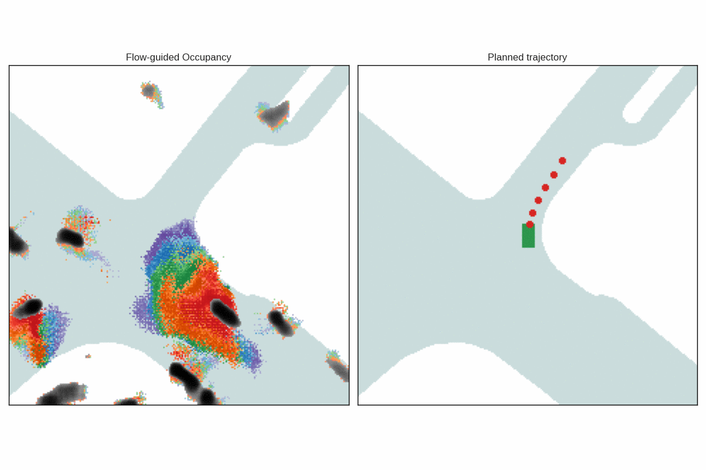
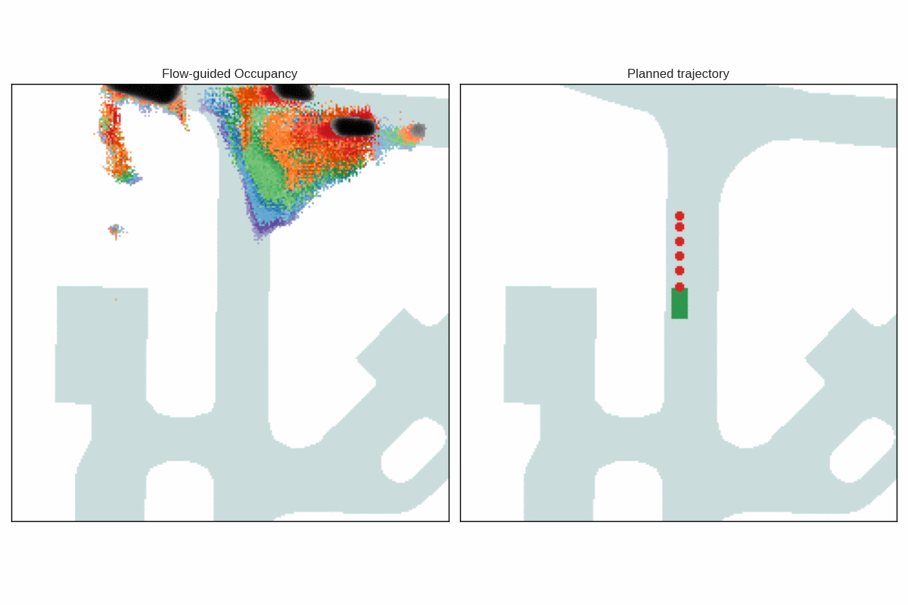
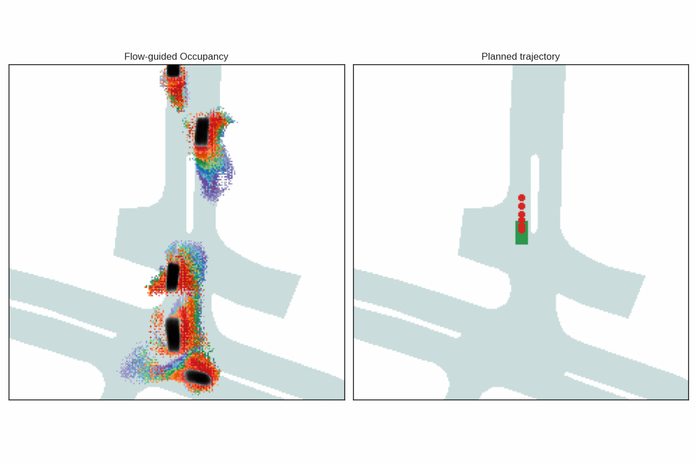

# PlanFlow: Local trajectory planning for autonomous driving using Flow-guided occupancy grids

## Abstract
Local trajectory planning for autonomous vehicles in urban scenarios requires reliable decisions around dense traffic and several agents’ interactions. The planner’s input strongly influences its reaction to different situations, hence the importance of choosing the appropriate representation. Bird’s-eye-view (BEV) grids provide spatial coverage, while vectorized representations offer efficiency but risk missing information. We propose using flow-guided occupancy grids, which are BEV occupancy maps augmented with cell flow vectors to combine occupancy, motion and uncertainty. Based on this representation, we present PlanFlow, a model based on a compact CNN as backbone with a MLP decoder, trained combining L1 and collision aware losses. We trained and evaluated PlanFlow on nuScenes against BEV input baselines, achieving robust accuracy and low collision rates, displaying improvement over the SOTA approaches by using flow-guided grids for trajectory planning reasoning.

## Qualitative results
A scene from nuScenes validation split is used to validate the trajectories in each scenario.
Example 1:

Example 2:

Example 3:

Example 4:

Example 5:

Example 6:

